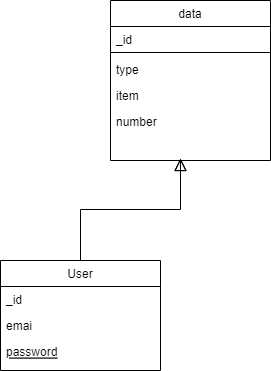

# Advanced Database COM526 Application Report

Name: Filipe Quartin
GitHub link: https://github.com/fmilheir/inventory-tracking
Cyclic: https://jade-clear-turtle.cyclic.app/
Stn: Q15287599

## Introduction
Managing a business is a complex and challenging task, one of the most critical aspects of which is the accurate tracking and management of inventory. The ability to know exactly what products are in stock, in what quantity and when they are sold is crucial for the smooth operation and success of any business. The problem is that this task can be overwhelming and time-consuming, especially for larger enterprises. My application aims to solve this problem by providing businesses with a powerful tool to effortlessly and accurately track and manage their inventory. From monitoring inventory levels, to tracking stock movements, my application is designed to help businesses streamline their operations, improve their efficiency and ultimately achieve greater success.

## System Overview
This application uses a variety of technologies, in order to make it clear and simple for me, I decided to use the MVC model (Model, View, Controller), since it is a very organized way and a very good practice when dealing with full stack applications, making it simple and organized.
About the technologies that were used on the project; for the front end ejs, css and bootstrap where used, for the backend Nodejs and JavaScript, connecting to MongoDB Atlas.
One of the main reasons why I decide to use Bootstrap is its responsive design feature which is enabled by its grid system. This allows developers to create websites that automatically adjust to different screen sizes and devices. Bootstrap also provides a wide range of pre-built UI components such as forms, buttons, navigation, and modals, which can be easily customized to match a website's design.
My application is divided in 2 main status:
- Page before inputting login credentials:
Where I explain about the program and provide the user the option to create an account or login, as well as why this application was built and how much it costs.
- The second part of this application is the after login, where the user has access to the database, here he stores the items and their quantity, and in order to keep track there status, once consumed/sold(deleted) I created the class ‘sold ’.
This class simply stores the items deleted by the user so it can see how many items have been used.
I enable the user to search using the search field passing the name of the item that the user pretends to find. The results will be shown below, if none is found a message saying “ No items found.” Will be displayed.
A filter drop-down was also added with the options to show only in-stock items, sold items or all of them.
The logo is a button for the home page, if the user is logged it directs to the /visualization, else to the /index.
The logo was made using https://www.canva.com/

## Key Design Decisions
For this application I created two different collections:
- Users
- Datas
The user collection is responsible of storing the user data(username and password), the password is encrypted using BCrypt. BCrypt is a slow algorithm which is good for security as it increases the time it takes to brute force the password.
It also stores the time of creation and the last time of modification.
The Datas collection is responsible of storing the items that each user wants to keep track of. It consist of an Item, a quantity and a type, the typeis just a simple Boolean that tells me If the Item is in stock or if it was sold (true-is in stock, false-sold).
The Datas collection was supposed to take as a parameter a column named user_id in order to just show the items related to the user, unfortunately I was not able to make it work.
In the security measures, I tried to create a session to validate the user, but I was getting the error (const user = await User.findById(req.session.userID);, TypeError: User.findById is not a function...). Despite this, I still implemented basic authentication using passport.js to ensure that only authorized users can access the database.

## Challenges
I faced many challenges while building this app:
- First, I had an extension called blackbox, this extension was influencing the submissions of my forms, making my app crash. I spent several days to find the cause of this problem and fix it.
- The second error that I faced was due to my internet connection's DNS, which gave me a MongoDB connection error. I also spent a lot of time trying to figure out what the problem was and how to fix it. I had to use my mobile data connection to receive a different DNS.

## Evaluation
I had big hopes for this project and was really hoping to ace it, but things didn't go as planned and I hit some roadblocks that really demotivated me and made me waste a lot of time trying to fix them. Once I got past those problems, I got my mojo back, but there wasn't enough time left to finish the project the way I wanted, like adding all those cool visualizations and functionality I had in mind.

## Conclusion
This project's functionality fell short of my expectations since I was unable to meet several of my objectives. I know of the existence of applications with similar functionality, despite this, I feel the project's concept has potential, and there may be space for development by identifying more practical methods to help specific circumstances.
To develop the program further, I would concentrate on finishing the sessions, ensuring that users only have access to their saved products, and generating visuals to highlight changes in inventory and sales. Another improvement would be to the type, where instead of deleting the item so it could be labeled sold, the quantity deleted would be marked as sold, leaving the rest as “stock”. This would enable true stock quantity management.
Minor controls, that only take a few lines of code to set up, should be implemented such as avoiding duplications and negative values.
I also had an idea to give a company id, that would allow users from the same company to have access to the same stock.

## Images

